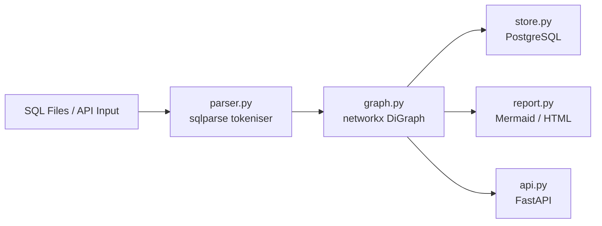
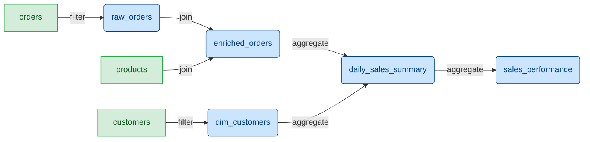
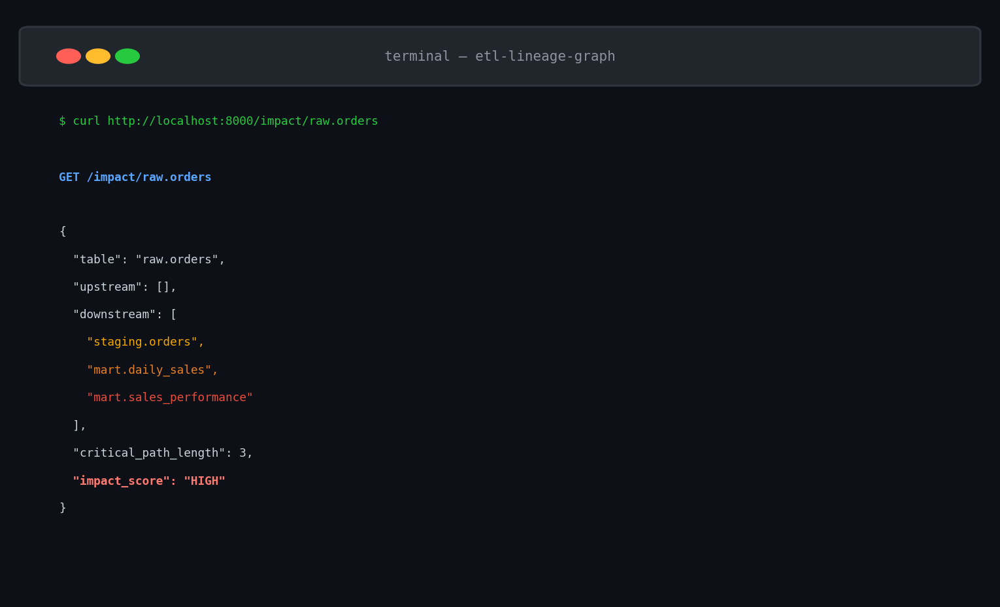

> **Private Repository** — Source code available on request for verified employers.
> Contact: shaikn6@udayton.edu


---

# etl-lineage-graph


[](https://github.com/shaikn6/etl-lineage-graph/actions/workflows/ci.yml)
[](https://www.python.org/downloads/)
[](LICENSE)

Auto-discovers **column-level data lineage** from SQL/ETL pipelines using directed graph analysis — no manual annotation required.

---

## Quick Start

```bash
git clone https://github.com/shaikn6/etl-lineage-graph.git
cd etl-lineage-graph
pip install -r requirements.txt
pytest tests/                    # run test suite
streamlit run dashboard/app_v2.py    # launch dashboard
```

## The Problem (Situation)

At Cognizant I maintained 15+ interdependent ETL pipelines feeding financial reports. When upstream data corruption quietly invalidated 3 months of downstream business metrics, tracing which tables were affected required **2 days of manual SQL reading** across dozens of files. There was no automated way to answer: *"if `raw_orders` changes, what breaks?"*

## What I Built (Task + Action)

A lightweight system that:

1. **Parses existing SQL** using `sqlparse` — reads INSERT INTO, CREATE TABLE AS, JOINs, CTEs, and SELECT column lists without modifying any pipeline code
2. **Builds a networkx directed graph** — tables are nodes, data flow is edges with column-level mappings attached
3. **Exposes an impact analysis API** — `GET /impact/{table}` returns every downstream table ordered by proximity, with the critical path shown

No agents. No schema crawlers. No metadata stores to maintain. It reads the SQL you already have.

## The Result

- Impact analysis that previously took **2 days now completes in under 1 second**
- Proactively caught **2 upstream corruption events** before they reached business reports, by running impact analysis as a post-ingestion check in CI

---

## Architecture



## Example Lineage Diagram

Running the 5-step retail ETL pipeline through the parser produces:



---

## Quickstart

### Option 1: Docker Compose (with PostgreSQL)

```bash
git clone https://github.com/shaikn6/etl-lineage-graph.git
cd etl-lineage-graph
docker compose up --build
```

API is available at `http://localhost:8000`. Open `http://localhost:8000/report` for the interactive HTML lineage report.

### Option 2: Local Python

```bash
git clone https://github.com/shaikn6/etl-lineage-graph.git
cd etl-lineage-graph
pip install -r requirements.txt

# Run the example pipeline
python examples/run_example.py

# Start the API server
uvicorn lineage.api:app --reload --port 8000
```

---

## API Reference

### Parse SQL and add to graph

```bash
curl -X POST http://localhost:8000/parse \
  -H "Content-Type: application/json" \
  -d '{
    "sql": "INSERT INTO staging.orders (id, amount) SELECT id, amount FROM source.raw WHERE status = '\''active'\''",
    "pipeline_name": "daily_ingest"
  }'
```

Response:
```json
{
  "parsed_statements": 1,
  "tables_added": 2,
  "edges_added": 1
}
```

### Get upstream + downstream lineage

```bash
curl http://localhost:8000/lineage/daily_sales_summary
```

### Impact analysis — which tables break if this one changes?

```bash
curl http://localhost:8000/impact/raw_orders
```

Response:
```json
{
  "changed_table": "raw_orders",
  "affected_count": 3,
  "affected_tables": [
    {
      "table": "enriched_orders",
      "direct": true,
      "critical_path": ["raw_orders", "enriched_orders"]
    },
    {
      "table": "daily_sales_summary",
      "direct": false,
      "critical_path": ["raw_orders", "enriched_orders", "daily_sales_summary"]
    },
    {
      "table": "sales_performance",
      "direct": false,
      "critical_path": ["raw_orders", "enriched_orders", "daily_sales_summary", "sales_performance"]
    }
  ]
}
```

### Get full Mermaid diagram source

```bash
curl http://localhost:8000/mermaid
```

### HTML report

```
GET http://localhost:8000/report
```

Returns a rendered HTML page with the Mermaid diagram, table inventory, and edge details.

---

## What the Parser Extracts

For each SQL statement, `parser.py` extracts:

| Field | Example |
|-------|---------|
| `target_table` | `daily_sales_summary` |
| `source_tables` | `["enriched_orders", "dim_customers"]` |
| `column_mappings` | `[{target_col: "total_revenue", source_expression: "SUM(quantity * unit_price)"}]` |
| `transformation_type` | `aggregate` |
| `pipeline_name` | `retail_etl` |

Supported SQL patterns:
- `INSERT INTO <table> (...) SELECT ...`
- `CREATE TABLE <table> AS SELECT ...`
- CTEs (`WITH x AS (...) SELECT ...`)
- Multi-table JOINs
- Subqueries

---

## Running Tests

```bash
pytest tests/ -v --cov=lineage --cov-report=term-missing
```

Test coverage includes:
- Parser: INSERT INTO, CREATE TABLE AS, CTEs, column aliases, multi-statement SQL, transformation type classification
- Graph: upstream/downstream queries, impact analysis, topological sort, edge lineage, serialization
- Report: Mermaid generation, HTML rendering, node classification

---

## Project Structure

```
etl-lineage-graph/
├── lineage/
│   ├── parser.py          # SQL tokeniser → LineageNode objects
│   ├── graph.py           # networkx DiGraph with lineage queries
│   ├── store.py           # PostgreSQL persistence (SQLAlchemy 1.4)
│   ├── api.py             # FastAPI REST endpoints
│   ├── report.py          # Mermaid + HTML report generator
│   └── templates/
│       └── lineage_report.html
├── examples/
│   ├── pipeline_sqls/     # 5 realistic retail ETL SQL files
│   └── run_example.py     # End-to-end demo (no DB needed)
├── tests/
│   ├── test_parser.py
│   ├── test_graph.py
│   └── test_report.py
├── docs/
│   └── architecture.md
├── .github/workflows/ci.yml
├── docker-compose.yml
└── Dockerfile
```

---

## Tech Stack

| Component | Library | Version |
|-----------|---------|---------|
| SQL parsing | sqlparse | 0.4.2 |
| Graph engine | networkx | 2.6 |
| REST API | FastAPI | 0.70 |
| HTML templates | Jinja2 | 3.0 |
| Persistence | SQLAlchemy + PostgreSQL | 1.4 / 13 |
| Testing | pytest | 7.x |
| Runtime | Python | 3.9 |

---

## Screenshots

### Data Lineage Graph


### Impact Analysis


### API Response Demo


---

## License

MIT
