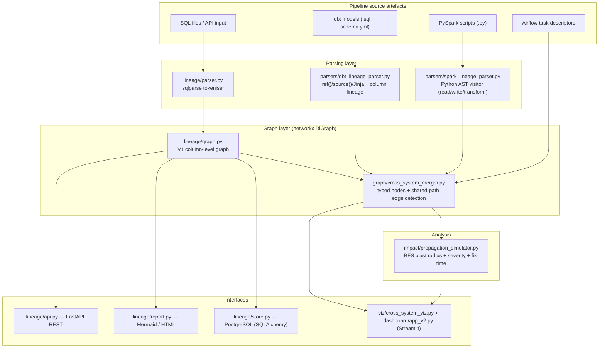
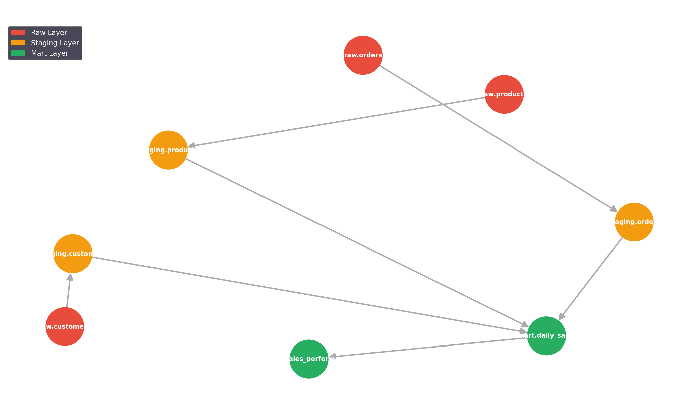
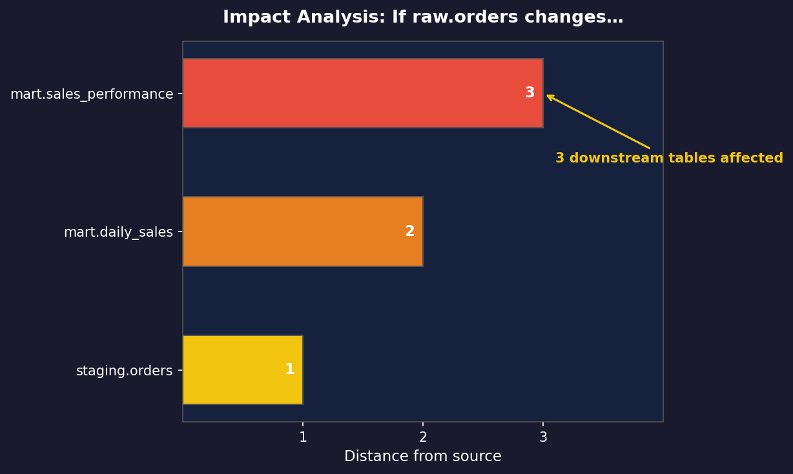
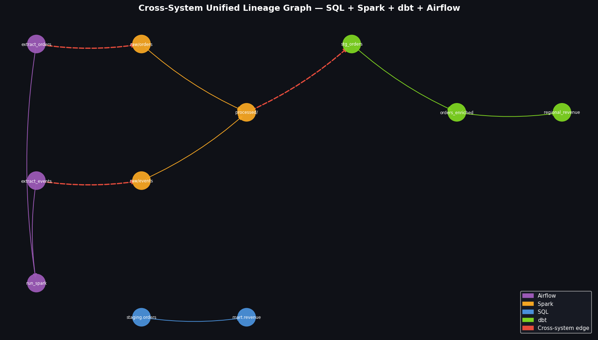
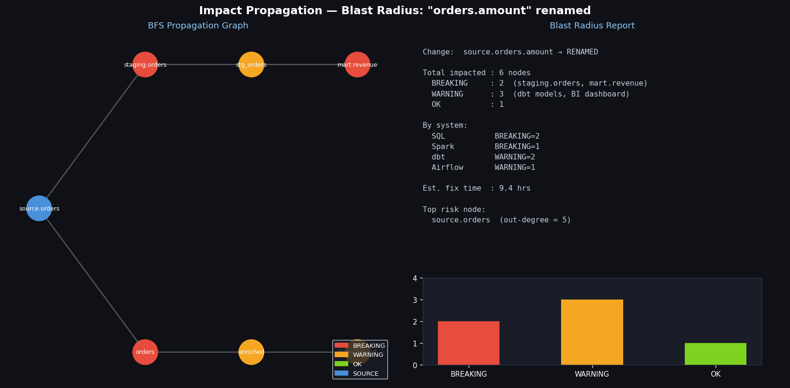
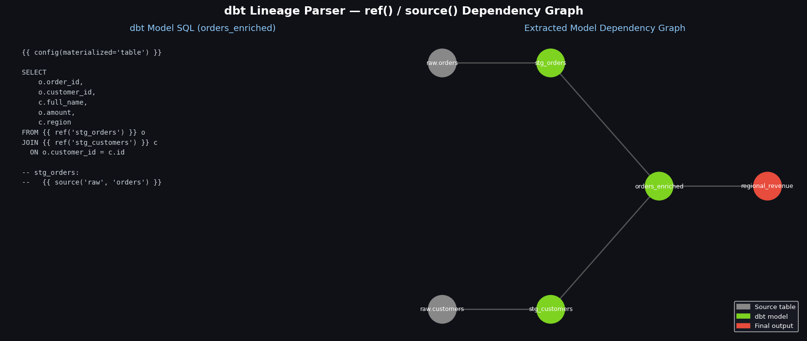
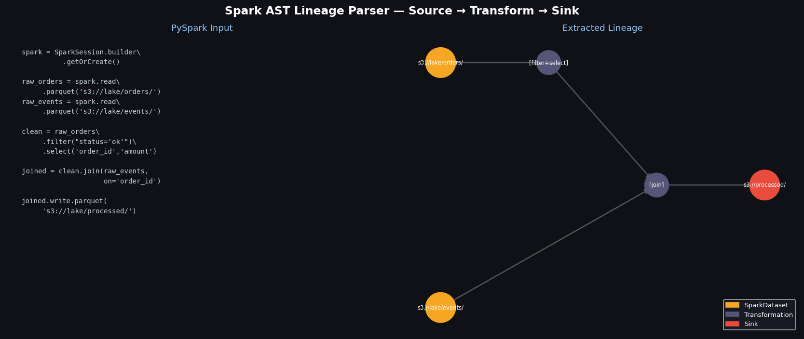

# etl-lineage-graph


[](https://www.python.org/downloads/)
[](LICENSE)

**Auto-discovers column-level data lineage across SQL, dbt, Spark, and Airflow — then simulates the blast radius of any schema change.** No manual annotation, no metadata store to maintain: it reads the pipeline code you already have.

---

## The Problem

Maintaining interdependent ETL pipelines feeding financial reports, a single question recurs constantly: *"if `raw_orders` changes, what breaks?"* Tracing it by hand means reading dozens of SQL files, dbt models, and Spark jobs across systems that don't share a lineage view — a multi-day exercise that still misses indirect, cross-system dependents.

`etl-lineage-graph` answers that question programmatically. It parses each system's source artefacts, merges them into one directed graph keyed on shared table/path identifiers, and runs a severity-classified propagation simulation so you see exactly which downstream assets break — and roughly how long the fix is — before you ship the change.

---

## Architecture

The system is two cooperating layers. **V1** extracts column-level lineage from raw SQL and serves it over a FastAPI/HTML interface. **V2** adds dedicated parsers for dbt, Spark, and Airflow, merges all four systems into a single unified graph, and runs change-impact (blast radius) simulation.



---

## How it works

### 1. Parsing — three engines, one node model

| System | Parser | Technique |
|--------|--------|-----------|
| **SQL** | `lineage/parser.py` | `sqlparse` tokeniser — extracts target table, source tables (FROM/JOIN with alias resolution), `{target_col: source_expression}` mappings, and a transformation type (`aggregate`/`join`/`filter`/`passthrough`). CTE names are stripped as virtual. |
| **dbt** | `parsers/dbt_lineage_parser.py` | Regex extraction of `{{ ref(...) }}` and `{{ source(...) }}` macros for inter-model deps, `config(materialized=...)` for materialization, plus paren-aware SELECT-list splitting for column lineage. Resolves each model to its warehouse table. |
| **Spark** | `parsers/spark_lineage_parser.py` | Walks the **Python AST** (`ast.NodeVisitor`). Detects `spark.read.<fmt>`/`load`/`table` sources and `df.write.<fmt>`/`saveAsTable` sinks, tracks intermediate DataFrame variables through method chains, and classifies transforms (`join`, `select`, `groupBy`, `filter`, `union`, `withColumn`). |

### 2. Graph construction

`lineage/graph.py` holds the V1 column-level graph as a `networkx.DiGraph` (tables = nodes, data flow = edges carrying column mappings). All lineage queries are `networkx` primitives:

| Query | networkx primitive |
|-------|--------------------|
| `get_upstream` | `nx.ancestors()` |
| `get_downstream` | `nx.descendants()` |
| `get_impact_analysis` | `nx.descendants()` + `nx.shortest_path()` |
| `topological_order` | `nx.topological_sort()` |

### 3. Cross-system merge

`graph/cross_system_merger.py` builds a **unified** `DiGraph` with typed nodes (`SourceTable`, `SparkDataset`, `DbtModel`, `AirflowTask`, `SinkTable`). It maintains a normalised **path index** mapping every table/path identifier to the nodes that read or write it, then infers cross-system edges where systems share a path — e.g. *Airflow writes a Parquet path → Spark reads the same path*, or *Spark writes a warehouse table → a dbt model `ref`s it*. Edge direction follows the pipeline order `airflow → sql → spark → dbt`.

### 4. Change-impact (blast radius) simulation

`impact/propagation_simulator.py` runs a **BFS** from the changed node over the unified graph and classifies each downstream node:

- **BREAKING** — directly consumes the changed column (rename/drop), or any consumer of a whole-table change.
- **WARNING** — wildcard `SELECT *` consumer, type-change consumer, or indirect consumer within 2 hops.
- **OK** — no detectable dependency on the changed column.

Propagation stops at `OK` nodes. The report aggregates counts **per system** and produces a heuristic fix-time estimate (per-system base hours × severity multiplier × distance factor). `top_risk_nodes()` ranks the highest-leverage nodes by `out_degree_centrality` — the ones that would cause the widest breakage if changed.

---

## Results (example pipeline)

Running the bundled 5-step retail ETL through the V1 pipeline (`python examples/run_example.py`) produces a verifiable, deterministic graph. Impact analysis for a change to `orders`:

```
Impact analysis: what breaks if 'orders' changes?
  AFFECTED: raw_orders            path: orders → raw_orders
  AFFECTED: enriched_orders       path: orders → raw_orders → enriched_orders
  AFFECTED: daily_sales_summary   path: orders → raw_orders → enriched_orders → daily_sales_summary
  AFFECTED: sales_performance     path: orders → raw_orders → enriched_orders → daily_sales_summary → sales_performance
```

The same multi-day manual trace described above resolves to an exact, ordered dependency chain in a single graph query.

**Test suite:** 140 tests pass (`pytest tests/ -q` → `140 passed`), covering the SQL parser, dbt parser, Spark AST parser, V1 graph queries, the cross-system merger, the propagation simulator, and report generation.

| Suite | Tests |
|-------|-------|
| `test_propagation_simulator.py` | 28 |
| `test_dbt_parser.py` | 21 |
| `test_spark_parser.py` | 20 |
| `test_cross_system_merger.py` | 19 |
| `test_parser.py` | 18 |
| `test_graph.py` | 18 |
| `test_report.py` | 16 |

---

## Quickstart

### Option 1 — Run the example (no database needed)

```bash
git clone https://github.com/shaikn6/etl-lineage-graph.git
cd etl-lineage-graph
pip install -r requirements.txt

python examples/run_example.py     # parses 5 SQL files → prints lineage + impact + Mermaid
pytest tests/ -q                   # 140 passing tests
```

### Option 2 — REST API

```bash
uvicorn lineage.api:app --reload --port 8000
# Swagger UI:   http://localhost:8000/docs
# HTML report:  http://localhost:8000/report
```

### Option 3 — Docker Compose (with PostgreSQL persistence)

```bash
docker compose up --build
# API:          http://localhost:8000
# HTML report:  http://localhost:8000/report
```

### Option 4 — V2 multi-system dashboard

```bash
streamlit run dashboard/app_v2.py
# Tabs: SQL Lineage · Cross-System Graph · Impact Analysis · System Comparison
```

---

## API Reference

```
GET  /health               liveness + node/edge count
POST /parse                parse a SQL string, update the graph
GET  /lineage/{table}      upstream + downstream JSON
GET  /upstream/{table}     ancestors only
GET  /downstream/{table}   descendants only
GET  /impact/{table}       impact analysis with critical paths
GET  /graph                full graph as JSON
GET  /tables               list all tracked tables
GET  /mermaid              Mermaid diagram source
GET  /report               rendered HTML report
```

Impact analysis response shape:

```json
{
  "changed_table": "raw_orders",
  "affected_count": 3,
  "affected_tables": [
    { "table": "enriched_orders",      "direct": true,  "critical_path": ["raw_orders", "enriched_orders"] },
    { "table": "daily_sales_summary",  "direct": false, "critical_path": ["raw_orders", "enriched_orders", "daily_sales_summary"] },
    { "table": "sales_performance",    "direct": false, "critical_path": ["raw_orders", "enriched_orders", "daily_sales_summary", "sales_performance"] }
  ]
}
```

---

## Project Structure

```
etl-lineage-graph/
├── lineage/
│   ├── parser.py              # SQL tokeniser → LineageNode objects
│   ├── graph.py               # V1 networkx DiGraph + lineage queries
│   ├── api.py                 # FastAPI REST endpoints
│   ├── report.py              # Mermaid + HTML report generator
│   ├── store.py               # PostgreSQL persistence (SQLAlchemy 1.4)
│   └── templates/lineage_report.html
├── parsers/
│   ├── dbt_lineage_parser.py  # dbt ref()/source()/Jinja + column lineage
│   └── spark_lineage_parser.py# PySpark AST lineage extraction
├── graph/
│   └── cross_system_merger.py # unified multi-system graph + edge inference
├── impact/
│   └── propagation_simulator.py # BFS blast-radius + severity + fix-time
├── viz/
│   └── cross_system_viz.py     # cross-system graph rendering
├── dashboard/app_v2.py         # Streamlit multi-tab dashboard
├── examples/
│   ├── pipeline_sqls/          # 5 realistic retail ETL SQL files
│   └── run_example.py          # end-to-end demo (no DB needed)
├── tests/                      # 140 tests across 7 suites
├── docs/architecture.md
├── docker-compose.yml
└── Dockerfile
```

---

## Tech Stack

`sqlparse` (SQL tokenising) · Python `ast` (Spark lineage) · `networkx` (graph engine) · FastAPI + Uvicorn (REST) · Jinja2 (HTML reports) · SQLAlchemy 1.4 + PostgreSQL (persistence) · Streamlit + pyvis + matplotlib (V2 dashboard) · pytest (140 tests) · Python 3.10+.

---

## Screenshots

| | |
|---|---|
| **Data Lineage Graph** | **Impact Analysis** |
|  |  |
| **Cross-System Lineage** | **Impact Propagation** |
|  |  |
| **dbt Lineage** | **Spark AST Lineage** |
|  |  |

---

## License

MIT
